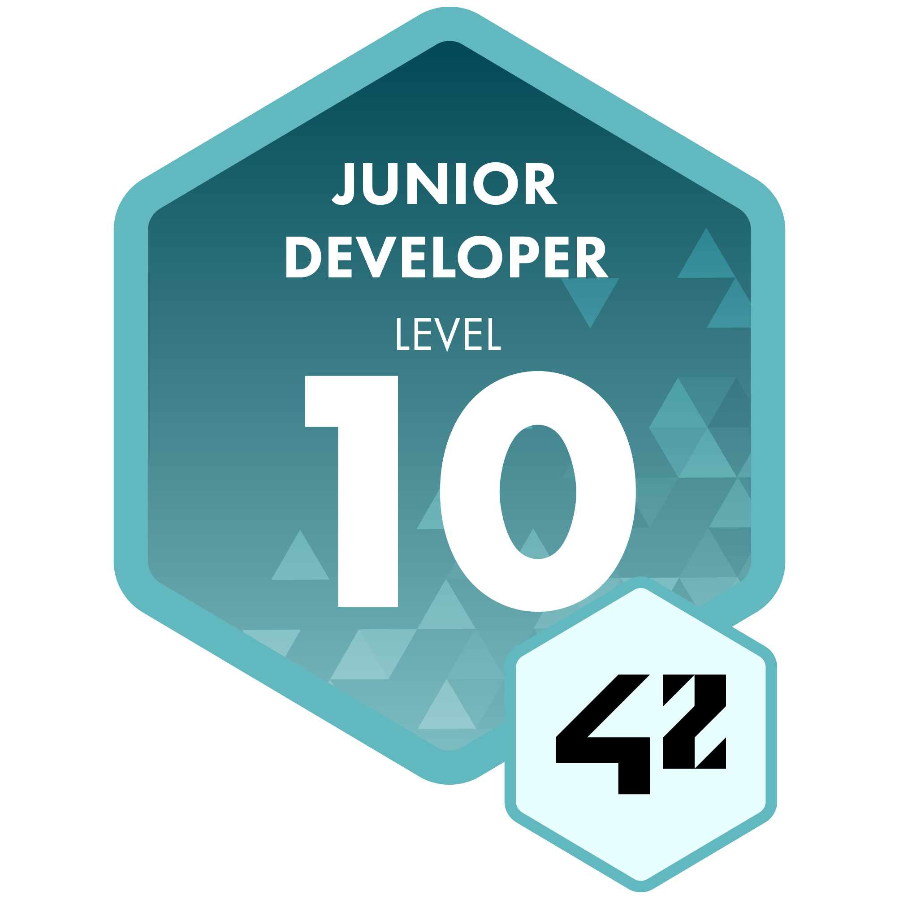

    

    <h2 style="border-bottom: 1px solid #d8dee4; color: #282d33;"> 🎓 Education & Certifications </h2>  

     42Seoul Alumni   
    

    <h2 style="border-bottom: 1px solid #d8dee4; color: #282d33;"> 🛠️ Tech Stacks </h2>   
    
 
          
          
          
          
           
          
          
          
           
          
          
          
          
           
          
          

    <h2 style="border-bottom: 1px solid #d8dee4; color: #282d33;"> 🧑‍💻 Contact me </h2>   
    
 
          

